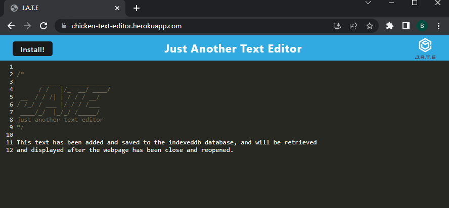

# Text Editor "JATE"

   [](https://opensource.org/licenses/MIT)

  ## Description
  This single-page text editor demonstrates the functionality of caching, browser-based database manipulation and PWA installation capabilities. This is built on Nodejs, utilizing webpack, indexedb, bable, all on an express server.

  ## [Live page here](https://chicken-text-editor.herokuapp.com/)

  * * * * * *


  ## Table of Contents
  1. [Description](#Description)
  2. [Installation](#Installation)
  3. [Usage](#Usage)
  4. [Questions](#questions)
  5. [License](#License)

  * * * * * *

  <a name="Installation"></a>
  ## Installation
  Clone repo, run "npm i", run "npm run start", then navigate to localhost:3000 for your live application.

  <a name="Usage"></a>
  ## Usage
  You are able to modify the text on the screen, click elsewhere, close out, then come back to the webpage and see all your changes persist. You can also download and install a standalone version of this app which has the same functionality.
  
  

  <a name="questions"></a>
  ## Questions
  For any questions, contact me at dev@chicken1991.anonaddy.com and [visit my github profile](https://github.com/chicken1991).

  <a name="License"></a>
  ## License


```md
COPYRIGHT 2022 Ben Pitroff
Permission is hereby granted, free of charge, to any person obtaining a copy of this software and associated documentation files (the "Software"), to deal in the Software without restriction, including without limitation the rights to use, copy, modify, merge, publish, distribute, sublicense, and/or sell copies of the Software, and to permit persons to whom the Software is furnished to do so, subject to the following conditions:

The above copyright notice and this permission notice shall be included in all copies or substantial portions of the Software.

THE SOFTWARE IS PROVIDED "AS IS", WITHOUT WARRANTY OF ANY KIND, EXPRESS OR IMPLIED, INCLUDING BUT NOT LIMITED TO THE WARRANTIES OF MERCHANTABILITY, FITNESS FOR A PARTICULAR PURPOSE AND NONINFRINGEMENT. IN NO EVENT SHALL THE AUTHORS OR COPYRIGHT HOLDERS BE LIABLE FOR ANY CLAIM, DAMAGES OR OTHER LIABILITY, WHETHER IN AN ACTION OF CONTRACT, TORT OR OTHERWISE, ARISING FROM, OUT OF OR IN CONNECTION WITH THE SOFTWARE OR THE USE OR OTHER DEALINGS IN THE SOFTWARE.
```        


[License: MIT](https://opensource.org/licenses/MIT)
